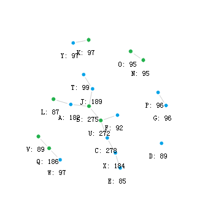

# Relation net visualization
Visualization for network data structure.

# Example
Here is an example.



# Prepare data
#### Step 1.
Assume we have a network with nodes and edges.

We need transform it to a map(python dict), like that:
```python
relationMap = {
    "Y-K": 97,
    "T-J": 99,
    ...
}
```
Reference: src/main.py getRelationDict()

#### Step 2.
Run script in src/main.py prepareGraph() to build a json file to render html.

#### Step 3.
Please use script in src/run_server.py to start a server. And finally we can show it in a Browser.  